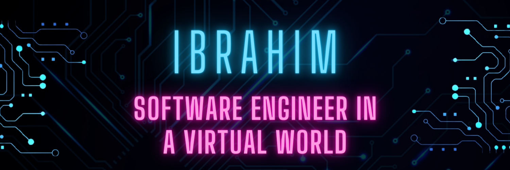

<!-- 
    
      ::::::::::: :::::::::  :::::::::      :::     :::    ::: :::::::::::   :::   :::          :::::::::      :::     :::::::::::   :::   :::   ::::::::::: 
         :+:     :+:    :+: :+:    :+:   :+: :+:   :+:    :+:     :+:      :+:+: :+:+:         :+:    :+:   :+: :+:       :+:      :+:+: :+:+:      :+:      
        +:+     +:+    +:+ +:+    +:+  +:+   +:+  +:+    +:+     +:+     +:+ +:+:+ +:+        +:+    +:+  +:+   +:+      +:+     +:+ +:+:+ +:+     +:+       
       +#+     +#++:++#+  +#++:++#:  +#++:++#++: +#++:++#++     +#+     +#+  +:+  +#+        +#++:++#:  +#++:++#++:     +#+     +#+  +:+  +#+     +#+        
      +#+     +#+    +#+ +#+    +#+ +#+     +#+ +#+    +#+     +#+     +#+       +#+        +#+    +#+ +#+     +#+     +#+     +#+       +#+     +#+         
     #+#     #+#    #+# #+#    #+# #+#     #+# #+#    #+#     #+#     #+#       #+#        #+#    #+# #+#     #+#     #+#     #+#       #+#     #+#          
########### #########  ###    ### ###     ### ###    ### ########### ###       ###        ###    ### ###     ### ########### ###       ### ###########       
   
-->

<h1 align="center">Ibrahim Raimi</h1>

<!-- PROFILE BANNER IMAGE -->

  

  Hello! Welcome to my GitHub profile! Thank you for visiting! 👋 

<h2 align="center">About Me</h2>

    My interest in programming started back in 2016 when i decided to build a virtul artificial intelligence from the ironman movie. - turns out hacking together an AI thought me a lot about the python programming language 😃.

  Fast-forward to February 2020, I picked up my knowledge of HTML, CSS, JavaScript, and React. Some of those tools were really difficult to learn, while others did not.  I used React first for a couple of small projects, then ended up building a <a href="https://lighthouse-agency.netlify.app/">Marketing Agency Website</a> with it. I recently picked up NodeJS and began exploring it, and so far am greatly enjoying what it has to offer!

## My Values

- 😎 Expression as authentic self.
- 📙 Beginner's mindset and curiosity
- 🔗 Shared understanding and consensus

## How I work

    My motivation are to stabilize and provide clarity through curiosity. That tends to manifest as creating just enought process.

<!-- GITHUB STATS -->
|  |  |
| ------------- | ------------- |

<!-- ------------------------------- -->
|  |  |
| ------------- | ------------- |
<!-- ------------------------------- -->

<!-- GITHUB GRAPH -->

<!-- GITHUB ANALYTICS -->
<!--  -->

<!-- CONTACT INFO -->
 

  
  

